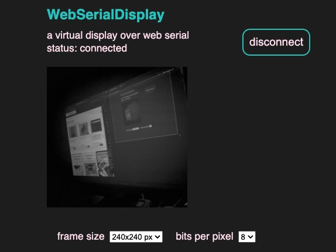

<!-- SPDX-License-Identifier: MIT -->
<!-- SPDX-FileCopyrightText: Copyright 2024 Sam Blenny -->
# WebSerialDisplay

A virtual CircuitPython display over Web Serial.

## Hardware

- Adafruit Proto Under Plate PiCowBell for Pico
  ([product page](https://www.adafruit.com/product/5905))

- Raspberry Pi Pico RP2040
  ([product page](https://www.adafruit.com/product/4864),
  [docs](https://www.raspberrypi.com/documentation/microcontrollers/raspberry-pi-pico.html))

- Stacking Headers for Raspberry Pi Pico - 2 x 20 Pin
  ([product page](https://www.adafruit.com/product/5582))

- Adafruit PiCowbell Camera Breakout, 72° lens
  ([learn guide](https://learn.adafruit.com/adafruit-picowbell-camera-breakout),
  [product page](https://www.adafruit.com/product/5945))

## Try the Project Bundle

This repo uses the GitHub Actions workflow from cookiecutter-playground-bundle
to build a project bundle zip archive for each tagged release. If you want to
try the code:

1. Go to the page for the
   [latest release](https://github.com/samblenny/webserialdisplay/releases).

2. Download the zip file attached to the release page. It should be named
   something similar to `webserialdisplay-27df0c3.zip`.

3. Expand the zip file (resulting folder should be named `webserialdisplay`).

4. Copy the contents of the `'webserialdisplay/CircuitPython 9.x'` folder to
   your CIRCUITPY drive (assuming your board is running CircuitPython 9.x).

