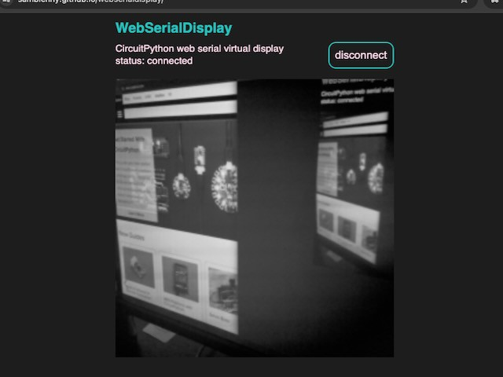

<!-- SPDX-License-Identifier: MIT -->
<!-- SPDX-FileCopyrightText: Copyright 2024 Sam Blenny -->
# WebSerialDisplay

A virtual CircuitPython display over Web Serial.

This demo uses Web Serial to receive video frames from a Pi Pico and show them
in a web GUI. It works like a virtual display. The video frames go over the
normal CircuitPython USB serial port as base64 encoded text with start and end
markers.

I developed this technique so I could have an easy way to monitor video from my
PiCowbell Camera Breakout. But, this approach could probably be adapted for use
as a virtual displayio display.




## Hardware

- Adafruit Proto Under Plate PiCowBell for Pico
  ([product page](https://www.adafruit.com/product/5905))

- Raspberry Pi Pico RP2040
  ([product page](https://www.adafruit.com/product/4864),
  [docs](https://www.raspberrypi.com/documentation/microcontrollers/raspberry-pi-pico.html))

- Stacking Headers for Raspberry Pi Pico - 2 x 20 Pin
  ([product page](https://www.adafruit.com/product/5582))

- Adafruit PiCowbell Camera Breakout, 72° lens
  ([learn guide](https://learn.adafruit.com/adafruit-picowbell-camera-breakout),
  [product page](https://www.adafruit.com/product/5945))


## Getting Started

To begin, solder the headers, assemble the stack of boards, install
CircuitPython, then copy the project bundle code to your CIRCUITPY drive. Once
that's all done, code.py will begin capturing camera frames and sending them
over the serial console. To see the video frames, you will need to:

1. Load the static web GUI page, CIRCUITPY/index.html, included in the project
   bundle using a modern browser that supports the Web Serial API (Chrome on
   macOS works well)

2. Click the "Connect" button (make sure your board is plugged in to the USB
   port)

3. Pick your your board from the list. It may be called "Pico ..."

Once you pick your board, the web GUI's javascript code may take a second or
two to sync with the serial stream before it begins showing video frames.


## Understanding the Virtual Display

This project has two main cooperating parts:

1. On the Pi Pico board, CIRCUITPY/code.py captures video frames from the
   camera, encodes the pixels as base64 text, then sends them over the serial
   port.

2. In a browser on the host computer, CIRCUITPY/index.html uses the Web Serial
   API to receive base64 encoded video frames which it draws to an HTML canvas
   element.

The base64 encoded frame buffer data sent over the serial port looks similar to
this:

```
-----BEGIN FRAME-----
NTE0NjEyNTY4MzQ0MjM1Nzg2MjE0NjY0Mzc3NjY0NTYzNjU3Nzk5Njg2NjY4Nzo8
OTY4OTo6Ojk6OTc5OTk8PD06Ojg2NTYxLS4uKyorLCwvLC0tLzAuMTAzMS4vMS8u
...
MTEzNjU2MzI0NTg0NTU2MTMzMjU1MzY3NzY2NzY2Njg3NDk5OTk5Ojk4Nzk4ODg6
NzY6Ojc4ODg3Nzs7Ozs7Oz07Ojk3NTU1ODMwMDAvLCwsLS0vLi0vLTEvMTEuLjEz
-----END FRAME-----
mem_free 97472
-----BEGIN FRAME-----
MzMyMjMzNDY0NDEyNjQ2NjUzNDQyMzQyMTM2NTMyNTQ3NTg3Nzk4NTg5ODc6Ojo5
Nzc3Nzc4ODg4OTk4ODg4OTo4OjY1NTYyMC8uLSwqKSwsKSsuLy4uLjEvLywuLi4t
...
LSouLy0sLC4tLCsvLiwrLiwuLSwsKisrLSksLCgoKSgnJykpJiYoKCsrJiYnJyUl
JSgkIyQkJCMhHyIkJCYmIx4hIR4dHyIeHx4cHB0iHhsWGCAbGRgWGBwXFhkYFRYa
-----END FRAME-----
mem_free 97472
```


## Try the Project Bundle

This repo uses the GitHub Actions workflow from cookiecutter-playground-bundle
to build a project bundle zip archive for each tagged release. If you want to
try the code:

1. Go to the page for the
   [latest release](https://github.com/samblenny/webserialdisplay/releases).

2. Download the zip file attached to the release page. It should be named
   something similar to `webserialdisplay-27df0c3.zip`.

3. Expand the zip file (resulting folder should be named `webserialdisplay`).

4. Copy the contents of the `'webserialdisplay/CircuitPython 9.x'` folder to
   your CIRCUITPY drive (assuming your board is running CircuitPython 9.x).

